# Lab 07 - Manage Azure Storage


## Índice

- [Descripción del laboratorio](#descripción-del-laboratorio)
- [Escenario del laboratorio](#escenario-del-laboratorio)
- [Esquema Visual del Laboratorio](#esquema-visual-del-laboratorio)
- [Habilidades adquiridas](#habilidades-adquiridas)
- [Costo Total del Laboratorio](#costo-total-del-laboratorio)  
- [Desarrollo del laboratorio](#desarrollo-del-laboratorio)
  - [Tarea 1: Crear y configurar una cuenta de almacenamiento](#tarea-1-crear-y-configurar-una-cuenta-de-almacenamiento)
  - [Tarea 2: Crear y configurar almacenamiento de blobs seguro](#tarea-2-crear-y-configurar-almacenamiento-de-blobs-seguro)
  - [Tarea 3: Crear y configurar almacenamiento-de-archivos-seguro](#tarea-3-crear-y-configurar-almacenamiento-de-archivos-seguro)
- [Conceptos reforzados](#conceptos-reforzados)
- [Resultados esperados](#resultados-esperados)
- [Limpieza de recursos](#limpieza-de-recursos)
- [Contribuciones](#contribuciones)
- [Licencia](#licencia)

---

## Descripción del laboratorio

Este laboratorio corresponde al módulo **AZ-104 Microsoft Azure Administrator**, específicamente el **Lab 07 - Manage Azure Storage**. Los laboratorios oficiales se encuentran disponibles en [Microsoft Learning Labs AZ-104](https://microsoftlearning.github.io/AZ-104-MicrosoftAzureAdministrator/).

El propósito es aprender a crear cuentas de almacenamiento en Azure, configurar contenedores de blobs y compartir archivos de manera segura, aplicando políticas de acceso, reglas de ciclo de vida y restricciones de red. Además, se explora el uso de **Storage Browser** para administrar recursos y se evalúa la idoneidad de **Azure Files** como reemplazo de compartidos locales.

La práctica se centra en tres tareas principales:

1. **Crear y configurar una cuenta de almacenamiento** con redundancia geográfica y restricciones de acceso público.
2. **Crear y configurar almacenamiento de blobs seguro**, aplicando políticas de retención inmutable y acceso restringido mediante SAS.  
3. **Crear y configurar almacenamiento de archivos seguro**, gestionando un file share con Storage Browser y limitando el acceso a través de redes virtuales y endpoints de servicio.

El laboratorio refuerza conceptos clave de administración de almacenamiento en la nube:

- Diferencias entre blobs y file shares.
- Configuración de redundancia y políticas de ciclo de vida para optimizar costos.  
- Uso de **SAS tokens** para acceso temporal y controlado.  
- Restricción de acceso mediante redes virtuales y endpoints de servicio.  
- Buenas prácticas de seguridad y limpieza de recursos para evitar costos innecesarios.

---

## Escenario del laboratorio

Nuestra organización actualmente almacena datos en repositorios locales. La mayoría de estos archivos no se acceden con frecuencia. Deseamos minimizar el costo de almacenamiento colocando los archivos de acceso poco frecuente en niveles de almacenamiento de menor precio. También se planea explorar los diferentes mecanismos de protección que ofrece Azure Storage, incluyendo acceso a la red, autenticación, autorización y replicación. Finalmente, queremos determinar en qué medida Azure Files es adecuado para hospedar nuestros archivos compartidos On-Premises.

---

## Esquema Visual del Laboratorio


---

## Habilidades adquiridas

Al completar este laboratorio hemos desarrollado y reforzado las siguientes habilidades:

- **Administración de cuentas de almacenamiento en Azure**, incluyendo configuración de redundancia, acceso público y reglas de ciclo de vida.  
- **Gestión de Blob Storage**, creando contenedores seguros, aplicando políticas de retención inmutable y controlando accesos mediante SAS tokens.  
- **Implementación de Azure File shares**, explorando su administración con Storage Browser y configurando estructuras de directorios.  
- **Aplicación de restricciones de red**, utilizando redes virtuales y endpoints de servicio para limitar el acceso a los recursos de almacenamiento.  
- **Optimización de costos de almacenamiento**, comprendiendo el uso de diferentes tiers (Hot, Cool, Archive) y sus implicancias en escenarios reales.  
- **Buenas prácticas de seguridad y gobernanza**, garantizando protección de datos, control de accesos y limpieza de recursos para evitar gastos innecesarios.  

Estas habilidades son fundamentales para desempeñarnos como administradores de Azure, asegurando un manejo eficiente, seguro y económico de los servicios de almacenamiento en la nube.

---

## Costo Total del Laboratorio

**El costo real del Lab 07 en Azure es mínimo si se ejecuta solo para práctica (menos de $0.10 USD por hora), pero mantener los recursos activos todo el mes puede costar entre $50 y $80 USD dependiendo del tier de almacenamiento y redundancia elegida.**  

### 1. Blob Storage (East US, Standard GPv2)  

[Precios oficiales por GB/mes :](https://azure.microsoft.com/en-us/pricing/details/storage/blobs/)

- **Hot tier**: **$0.018 USD/GB**  
- **Cool tier**: **$0.01 USD/GB**  
- **Archive tier**: **$0.002 USD/GB**  
- **Operaciones de lectura/escritura**: ~$0.005 USD por 10,000 operaciones  

>En el laboratorio se sube un archivo pequeño (ej. 10 MB). El costo real es **< $0.01 USD** por ejecución.

---

### 2. Azure Files (Transaction Optimized, East US)  

[Precios oficiales por GB/mes :](https://azure.microsoft.com/en-us/pricing/details/storage/files/)

- **Transaction Optimized tier**: **$0.06 USD/GB**  
- **Hot tier**: **$0.08 USD/GB**  
- **Cool tier**: **$0.015 USD/GB**  
- **Premium SSD tier**: **$0.16 USD/GB**  
- **Transacciones**: ~$0.001 USD por 10,000 operaciones  

>En el laboratorio se crea un file share y se sube un archivo pequeño. El costo real es **< $0.05 USD** por ejecución.

---

### 3. Cuenta de almacenamiento (GRS)  

- No tiene costo fijo, se paga por uso de almacenamiento y redundancia.  
- **Geo-redundant storage (GRS)** incrementa el precio por GB respecto a LRS.  
- Para datos pequeños en laboratorio, el costo es **prácticamente nulo (< $0.01 USD)**.  

---

### 4. Networking y Endpoints  

- Configurar una vNet y endpoints de servicio **no genera costos adicionales**.  
- El tráfico de red en pruebas es mínimo.  

---

### Resumen de costos

| Recurso                        | Costo mensual aprox. | Costo por 1 hora (lab) |
|--------------------------------|-----------------------|-------------------------|
| Blob Storage (Hot + Cool)      | $0.018–0.01 USD/GB    | < $0.01 USD             |
| File Storage (Transaction opt.)| $0.06 USD/GB          | < $0.05 USD             |
| Cuenta de almacenamiento (GRS) | Incluido en uso       | < $0.01 USD             |
| Networking + Endpoints         | $0                    | $0                      |
| **Total estimado**             | **~$50–80 USD/mes***  | **< $0.10 USD por ejecución** |

> Estimación mensual suponiendo 1 TB de datos activos en Blob + File Storage con redundancia GRS.  

---

## ⚠️ Consideraciones

- Los costos dependen del **tier de almacenamiento** (Hot, Cool, Archive).  
- En el laboratorio, al trabajar con archivos pequeños y uso puntual, el costo es **mínimo**.  
- Mantener recursos activos con volúmenes grandes (ej. 1 TB) puede superar los **$50–80 USD/mes**.  
- La limpieza de recursos al finalizar es esencial para evitar cargos innecesarios.

---

## Desarrollo del laboratorio

### Tarea 1: Crear y configurar una cuenta de almacenamiento

En esta tarea crearemos y configuraremos una **cuenta de almacenamiento** en Azure. La cuenta usará redundancia geográfica y no tendrá acceso público habilitado.

### Pasos

1. **Iniciar sesión en el portal de Azure**  
   - Accedemos a [https://portal.azure.com](https://portal.azure.com).

2. **Buscar y seleccionar cuentas de almacenamiento**  
   - En el portal, buscamos *Storage accounts* y seleccionamos **+ create**
    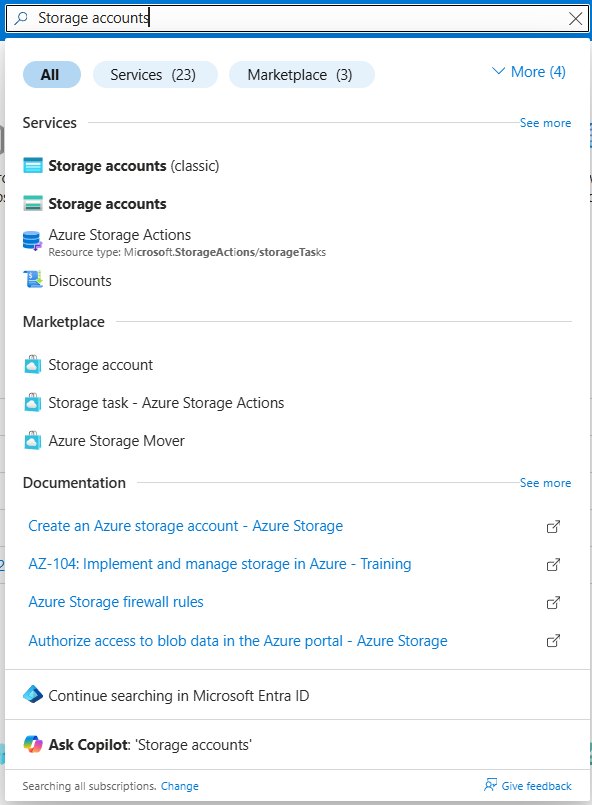
    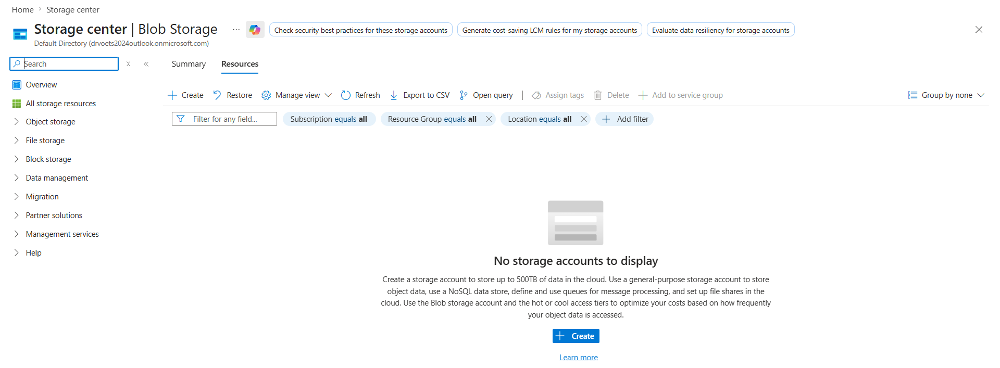

3. **Configurar la pestaña *Basics***
   - **Subscription**: seleccionamos el nombre de nuestra suscripción de Azure.  
   - **Resource group**: creamos uno nuevo llamado `az104-rg7`.  
   - **Storage account name**: ingresamos un nombre único global (entre 3 y 24 caracteres, letras y dígitos).  
   - **Region**: elegimos **East US**.  
   - **Performance**: seleccionamos **Standard** (notar la opción Premium).  
   - **Redundancy**: configuramos **Geo-redundant storage (GRS)**.  
   - Marcamos la casilla *Make read access to data available in the event of regional unavailability*.

    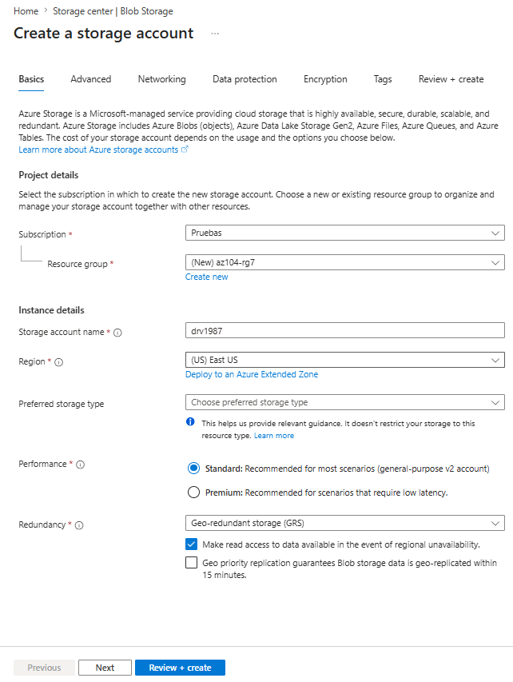

   > Nota: Se recomienda el nivel **Standard** para la mayoría de aplicaciones. El nivel **Premium** se utiliza en escenarios empresariales o de alto rendimiento.

4. **Configurar la pestaña *Advanced***  
   - Usamos los íconos informativos para aprender más sobre las opciones.  
   - Dejamos los valores por defecto.

5. **Configurar la pestaña *Networking***  
   - En la sección *Public network access*, seleccionamos **Disable**.  
   - Esto restringe el acceso entrante, permitiendo solo el acceso saliente.

6. **Revisar la pestaña *Data protection***
   - Observamos que la política de *soft delete* por defecto es de 7 días.
   - Notamos que se puede habilitar la *versioning* para blobs.
   - Aceptamos los valores por defecto.

7. **Revisar la pestaña *Encryption***
   - Revisamos las opciones adicionales de seguridad.
   - Aceptamos los valores por defecto.

8. **Crear la cuenta de almacenamiento**
   - Seleccionamos **Review + create**.
   - Esperamos a que la validación se complete y luego hacemos clic en **Create**.

    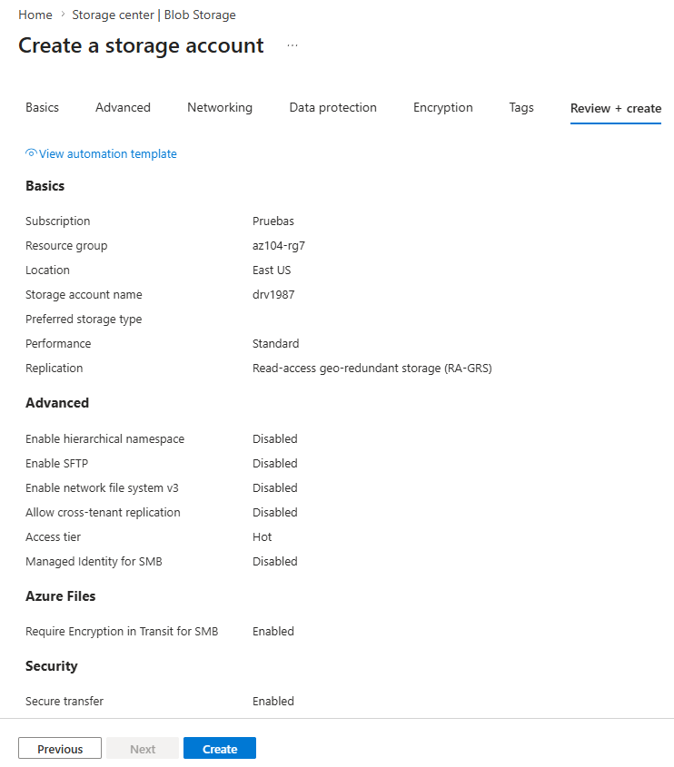

9. **Acceder al recurso creado**
   - Una vez desplegado, seleccionamos **Go to resource**.
    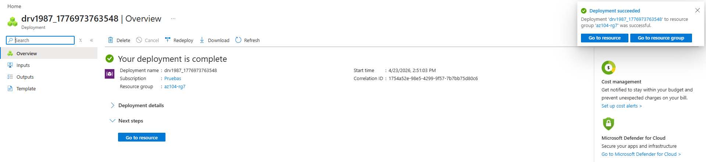

   - Revisamos el *Overview blade* y las configuraciones globales disponibles.  
   - Notamos que la cuenta puede usarse para **Blob containers, File shares, Queues y Tables**.

10. **Validar configuración de red**
    - En el *Security + networking blade*, seleccionamos **Networking**.  
    - Confirmamos que el acceso público está deshabilitado.
    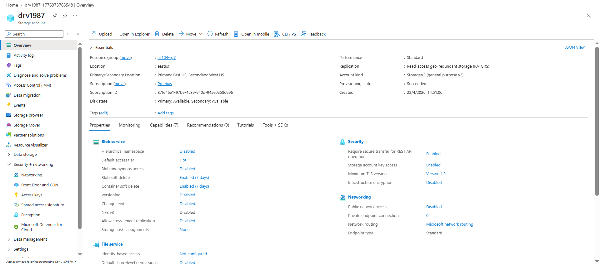

11. **Modificar acceso público**
    - Seleccionamos **Manage** y cambiamos el acceso público a **Enabled from selected networks**.
    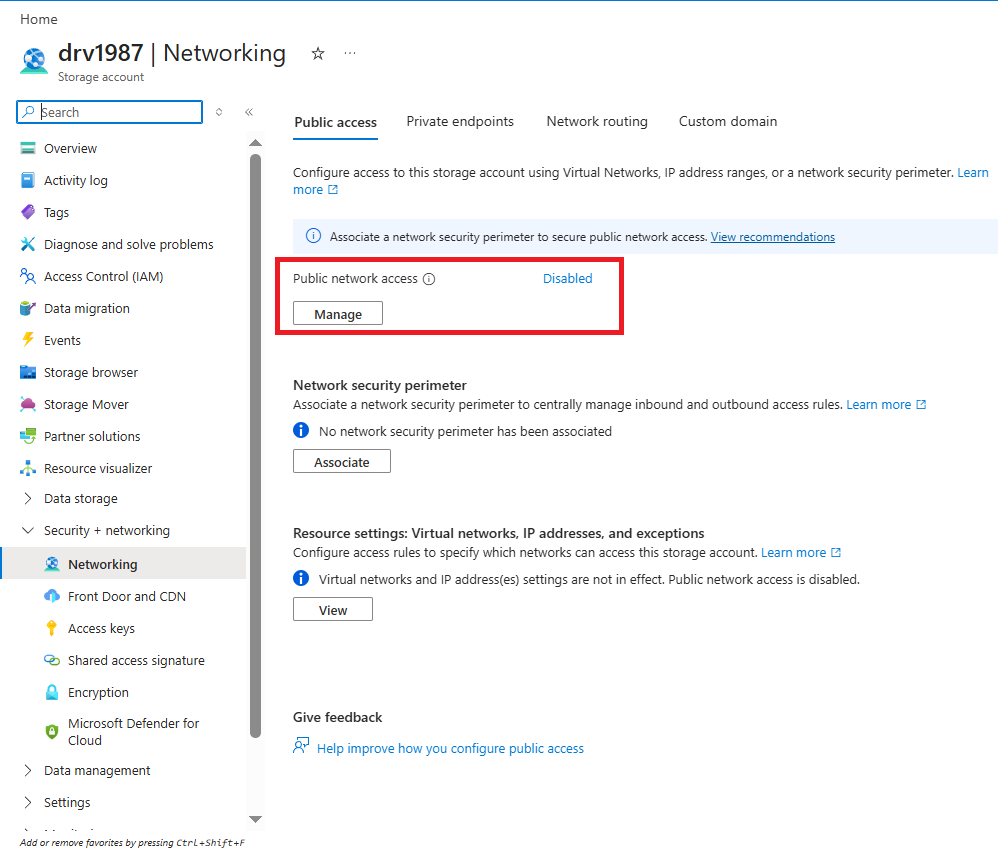
    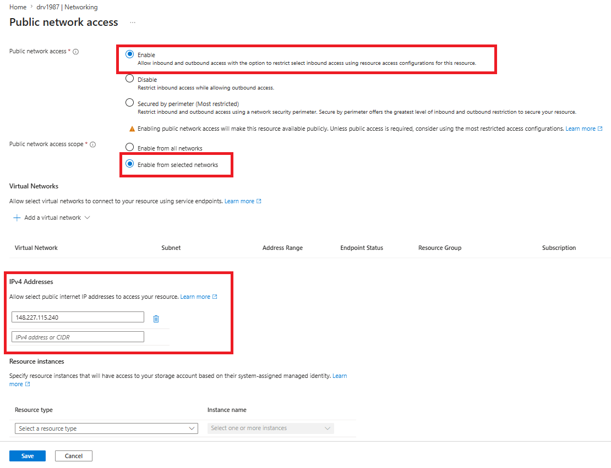
    - En la sección *IPv4 Addresses*, añadimos nuestra dirección IPv4 de cliente.  
    - Guardamos los cambios.

12. **Revisar redundancia y ciclo de vida**
    - En el *Data management blade*, seleccionamos **Redundancy** y verificamos la información sobre los centros de datos primario y secundario.
    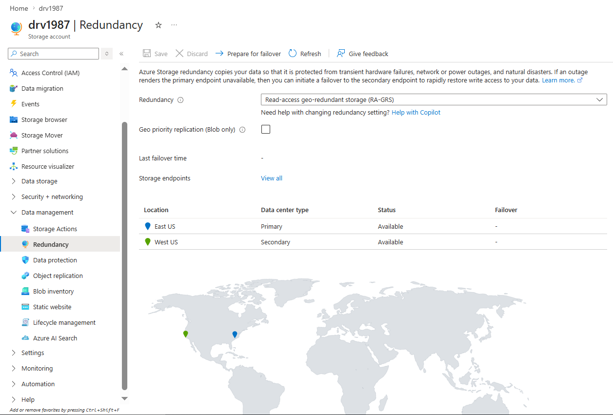

    - Luego, seleccionamos **Lifecycle management** y añadimos una regla:
    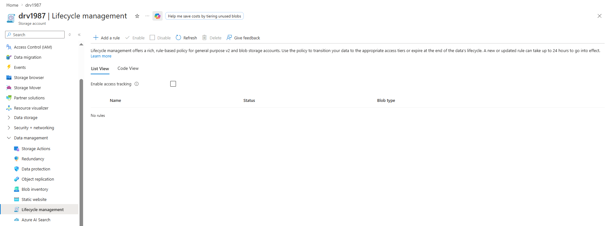

      - Nombre: `Movetocool`.
      - Condición: si los blobs base no se modificaron en más de 30 días → mover a almacenamiento *cool*.
      - Revisamos las demás opciones y seleccionamos **Add** cuando terminemos de explorar.
        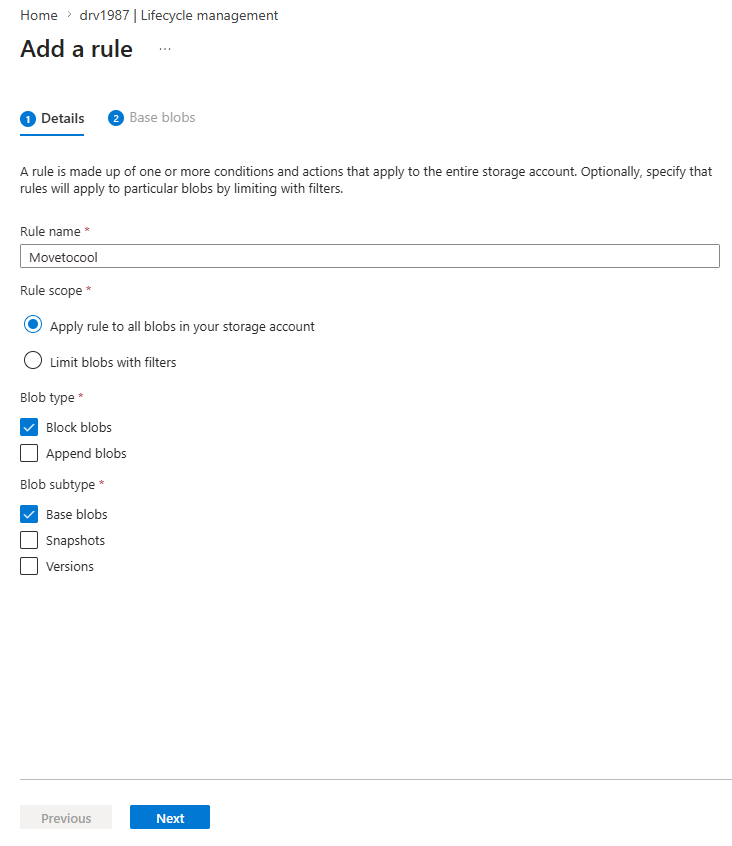
        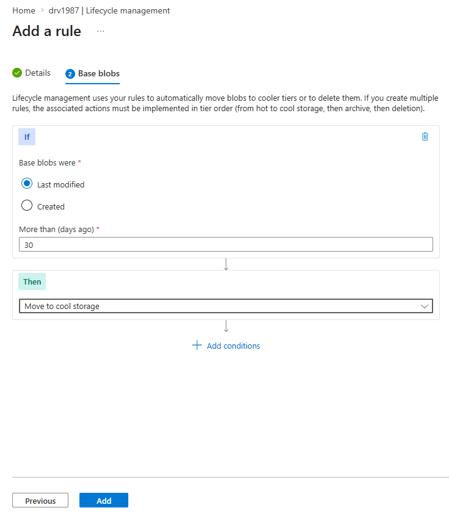
        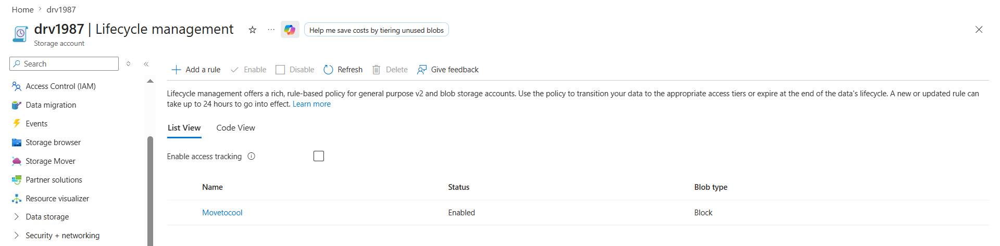

>Con esta tarea dejamos configurada una cuenta de almacenamiento segura, con redundancia geográfica y reglas de ciclo de vida que optimizan costos al mover datos poco utilizados a niveles más económicos.

---

### Tarea 2: Crear y configurar almacenamiento de blobs seguro

En esta tarea crearemos un **contenedor de blobs** y subiremos un archivo. Los contenedores de blobs son estructuras similares a directorios que almacenan datos no estructurados.

#### Crear un contenedor de blobs y una política de retención basada en tiempo

1. Continuamos en el **portal de Azure**, trabajando con nuestra cuenta de almacenamiento.
2. En el *Data storage blade*, seleccionamos **Containers**.
    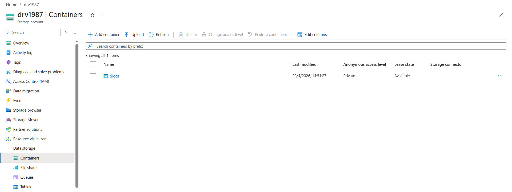

3. Hacemos clic en **+ Add container** y configuramos con los siguientes valores:  
   - **Name**: `data`
   - **Public access level**: privado (notar que el nivel de acceso está configurado como privado).

   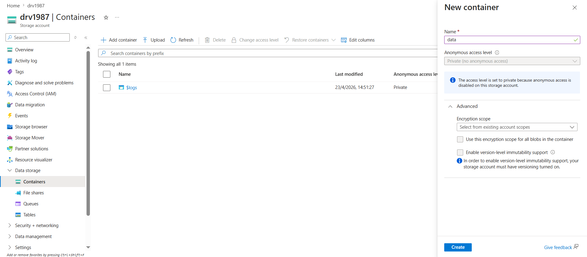

4. En el contenedor recién creado, desplazamos hacia el menú de opciones (…) en el extremo derecho y seleccionamos **Access policy**.
    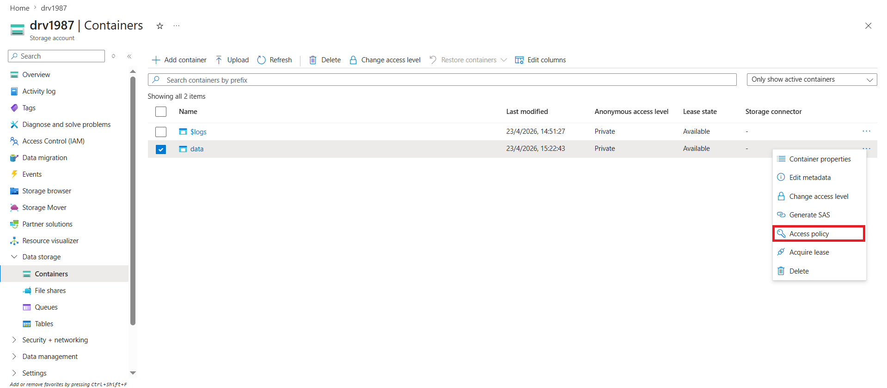

5. En el área de *Immutable blob storage*, seleccionamos **Add policy** y configuramos:

   - **Policy type**: *Time-based retention*
   - **Set retention period for**: 180 días
   - Seleccionamos **Save**.
    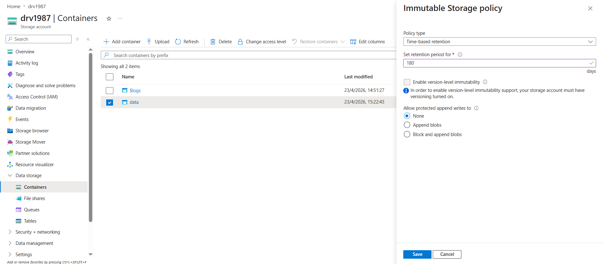

---

#### Administrar cargas de blobs

1. Volvemos a la página de contenedores, seleccionamos nuestro contenedor `data` y hacemos clic en **Upload**.  
2. En el panel *Upload blob*, expandimos la sección **Advanced**.  
   - **Browse for files**: seleccionamos un archivo para subir (puede ser cualquier archivo, se recomienda uno pequeño).  
   - **Blob type**: *Block blob*  
   - **Block size**: 4 MiB  
   - **Access tier**: *Hot* (notar las otras opciones disponibles).  
   - **Upload to folder**: `securitytest`  
   - **Encryption scope**: usar el alcance de cifrado por defecto del contenedor.  
   - Seleccionamos **Upload**.
   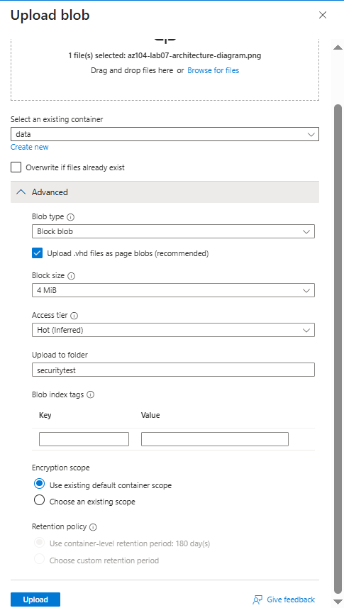

3. Confirmamos que se creó una nueva carpeta y que el archivo fue subido correctamente.
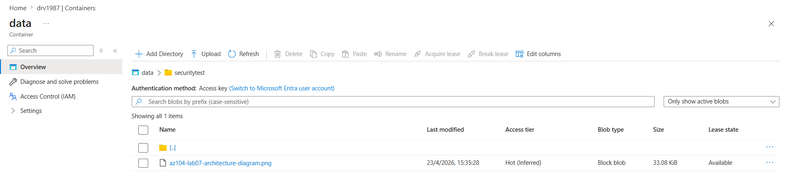

4. Seleccionamos el archivo subido y revisamos las opciones del menú (…) como **Download, Delete, Change tier, Acquire lease**.
5. Copiamos la URL del archivo (desde *Settings → Properties blade*) y la pegamos en una ventana de navegación InPrivate.  
    - Debemos ver un mensaje en formato XML indicando *ResourceNotFound* o *PublicAccessNotPermitted*.  
    - Esto es esperado, ya que el contenedor tiene el nivel de acceso público configurado como **Private** (sin acceso anónimo).
    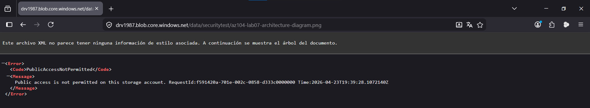

---

#### Configurar acceso limitado al almacenamiento de blobs

1. Volvemos al archivo subido, seleccionamos el menú (…) y luego **Generate SAS**.
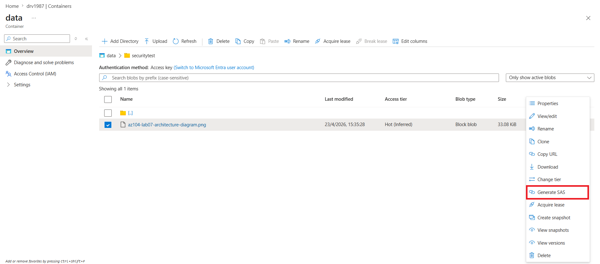

2. Configuramos los siguientes valores (dejamos los demás por defecto):  
    - **Signing key**: Key 1  
    - **Permissions**: Read (notar las otras opciones disponibles).  
    - **Start date**: fecha de ayer  
    - **Start time**: hora actual  
    - **Expiry date**: fecha de mañana  
    - **Expiry time**: hora actual  
    - **Allowed IP addresses**: dejar en blanco  
    - Seleccionamos **Generate SAS token and URL**.
    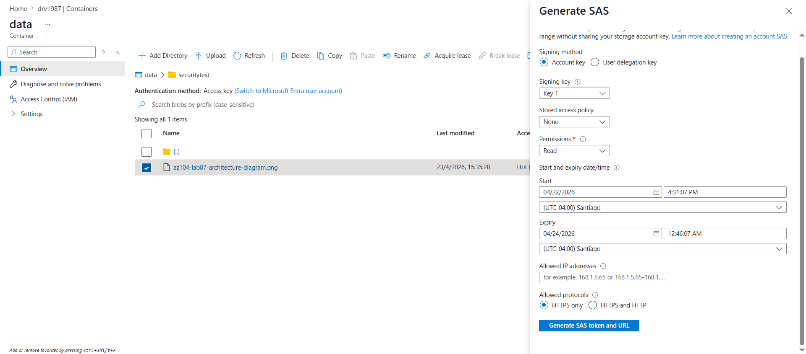

3. Copiamos la entrada **Blob SAS URL** al portapapeles.  
4. Abrimos otra ventana InPrivate y navegamos a la **Blob SAS URL** copiada.  
    - Debemos poder visualizar el contenido del archivo.
    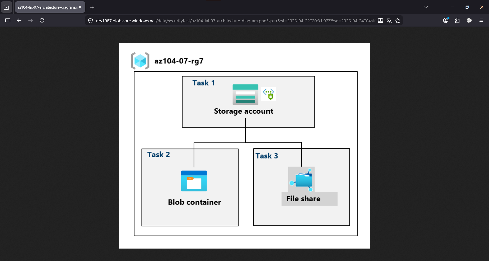

---

Con esta tarea dejamos configurado un contenedor de blobs seguro, con acceso público restringido, políticas de retención inmutable y acceso controlado mediante **SAS tokens**, lo que garantiza seguridad y cumplimiento en escenarios de almacenamiento en la nube.

---

### Tarea 3: Crear y configurar almacenamiento de archivos seguro

En esta tarea crearemos y configuraremos **Azure File shares**. Utilizaremos **Storage Browser** para administrar el recurso y luego restringiremos el acceso a la cuenta de almacenamiento mediante una red virtual.

---

### Crear el file share y subir un archivo

1. En el **portal de Azure**, navegamos de regreso a nuestra cuenta de almacenamiento.  
2. En el *Data storage blade*, seleccionamos **File shares**.
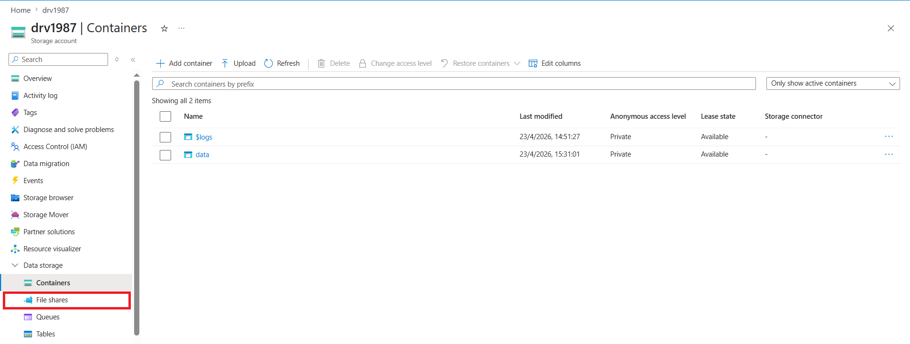
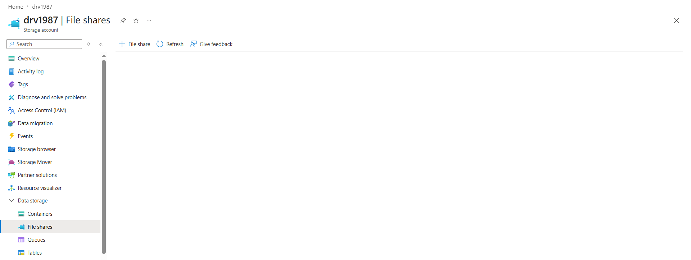

3. Hacemos clic en **+ File share** y en la pestaña *Basics* configuramos:  
   - **Name**: `share1`  
   - **Access tier**: dejamos el valor por defecto **Transaction optimized**.
   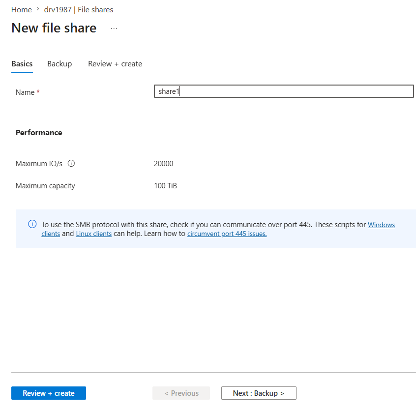

4. Pasamos a la pestaña *Backup* y verificamos que la opción **Enable backup** no esté marcada (deshabilitamos el backup para simplificar la configuración del laboratorio).  
5. Seleccionamos **Review + create** y luego **Create**.
6. Esperamos a que el file share se despliegue.  
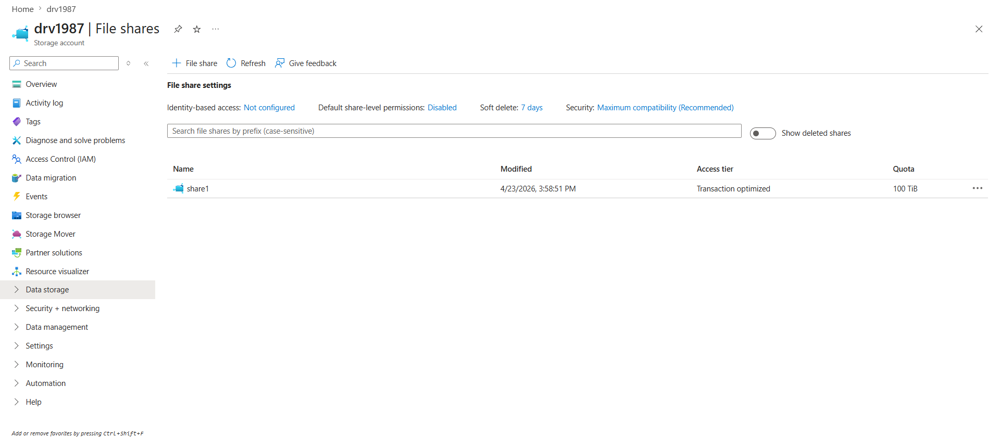

---

### Explorar Storage Browser y subir un archivo

1. Regresamos a nuestra cuenta de almacenamiento y seleccionamos **Storage browser**.  
   - El Storage Browser es una herramienta del portal que permite visualizar rápidamente todos los servicios de almacenamiento bajo la cuenta.

2. Seleccionamos **File shares** y verificamos que el directorio `share1` esté presente.
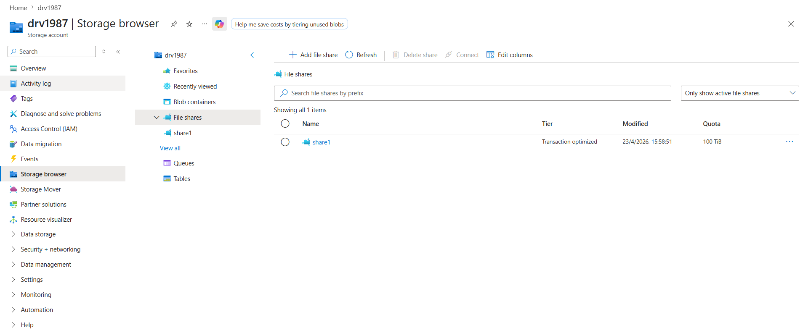

3. Ingresamos al directorio `share1` y notamos que podemos usar **+ Add directory** para crear una estructura de carpetas.
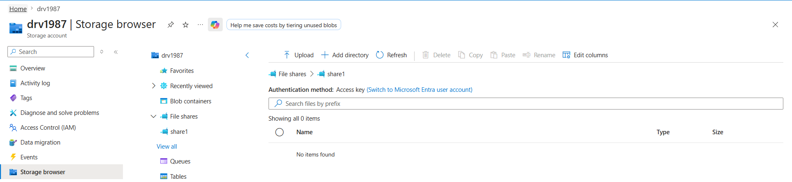

4. Seleccionamos **Upload**, buscamos un archivo de nuestra elección y hacemos clic en **Upload**.  
    > Nota: En este punto podemos ver y administrar los file shares sin restricciones.

---

### Restringir acceso de red a la cuenta de almacenamiento

1. En el portal, buscamos y seleccionamos **Virtual networks**.
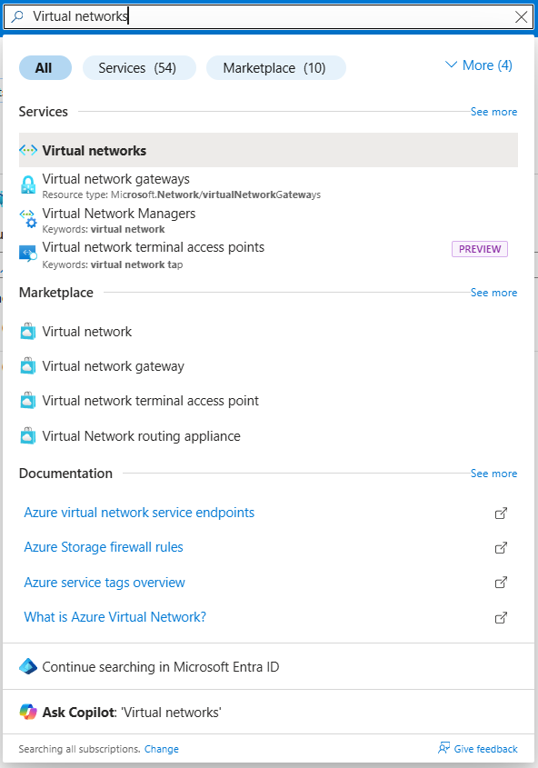

2. Hacemos clic en **+ Create**, seleccionamos nuestro grupo de recursos y damos el nombre `vnet1` a la red virtual.
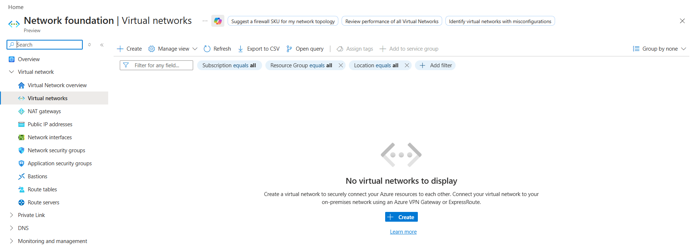

3. Dejamos los valores por defecto en los demás parámetros, seleccionamos **Review + create** y luego **Create**.
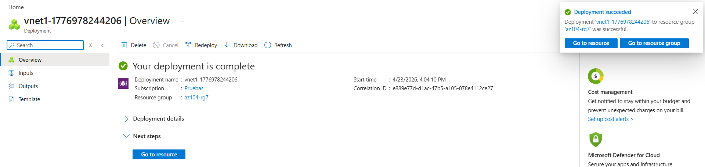

4. Esperamos a que la red virtual se despliegue y seleccionamos **Go to resource**.  
5. En la sección *Settings*, seleccionamos **Service endpoints**.  
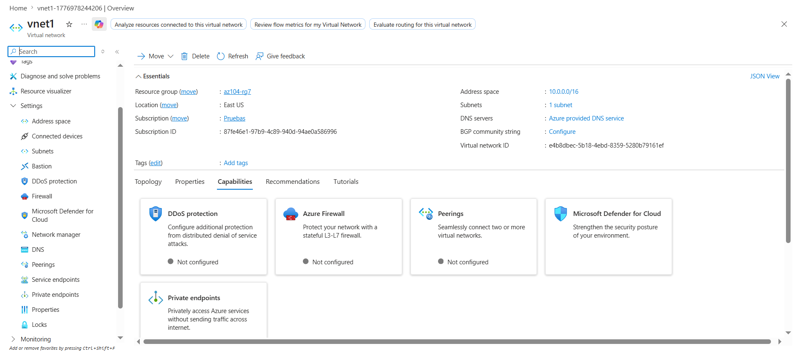

6. Hacemos clic en **Add** y configuramos:  
    - **Service**: `Microsoft.Storage`  
    - **Subnets**: marcamos la opción *Default subnet*  
    - Seleccionamos **Add** para guardar los cambios.
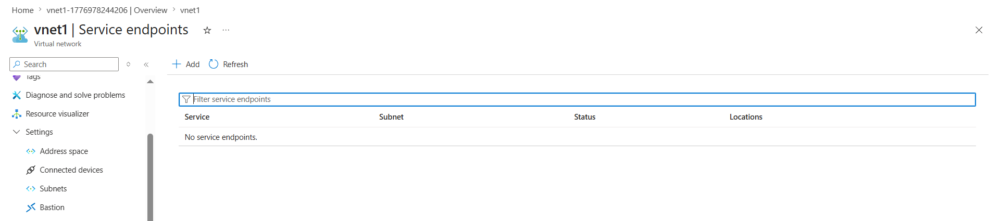

7. Regresamos a nuestra cuenta de almacenamiento.  
8. En el *Security + networking blade*, seleccionamos **Networking**.
9. Bajo *Public network access*, seleccionamos **Manage**.
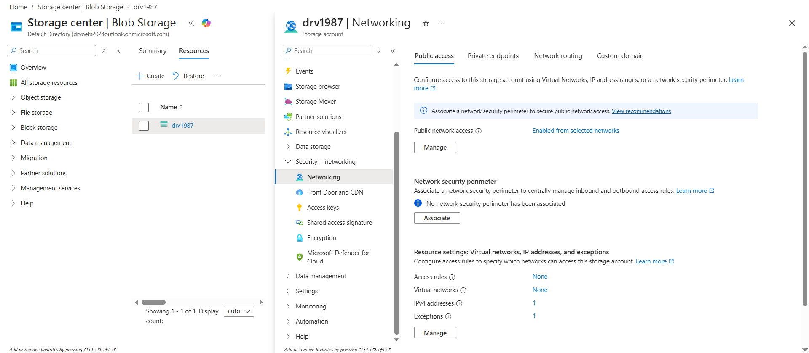

10. Hacemos clic en **Add a virtual network** y luego en **Add existing network**.  
11. Seleccionamos `vnet1` y la *default subnet*, luego hacemos clic en **Add**.
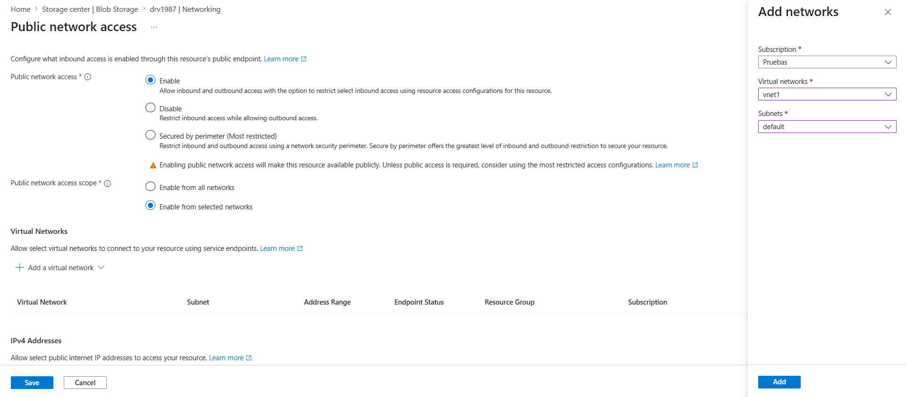

12. En la sección *IPv4 Addresses*, eliminamos la dirección IP de nuestra máquina.  
    - El tráfico permitido debe provenir únicamente de la red virtual.  
13. Guardamos los cambios.

---

### Validar restricciones de acceso

1. Seleccionamos **Storage browser** y actualizamos la página.  
2. Navegamos hacia nuestro file share o contenido de blobs.  
3. Debemos recibir un mensaje indicando que **no estamos autorizados para realizar esta operación**, ya que no estamos conectados desde la red virtual configurada. 
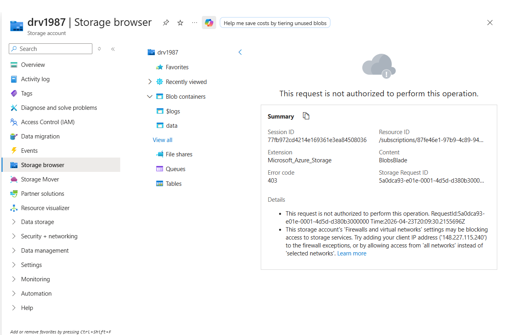

    - Puede tardar algunos minutos en aplicarse la restricción.  
    - Es posible que aún podamos ver el file share, pero no acceder a los archivos o blobs dentro de la cuenta de almacenamiento.  

   > Captura: acceso no autorizado.

---

Con esta tarea dejamos configurado un **Azure File share** administrado mediante Storage Browser y protegido con restricciones de red, asegurando que solo pueda ser accedido desde una red virtual autorizada.

---

## Conceptos reforzados

- Diferencias entre **Blob Storage** y **File Storage**.  
- Uso de **tiers de almacenamiento** para optimizar costos.  
- Políticas de retención inmutable y control de acceso mediante **SAS tokens**.  
- Restricción de acceso con **service endpoints** y redes virtuales.  
- Importancia de limpiar recursos al finalizar el laboratorio para evitar costos adicionales.

---

## Resultados esperados

Al finalizar este laboratorio deberíamos haber logrado los siguientes resultados:

- **Creación y configuración de una cuenta de almacenamiento** en Azure con redundancia geográfica (GRS), acceso público deshabilitado y reglas de ciclo de vida para optimizar costos.  
- **Implementación de un contenedor de blobs seguro**, con políticas de retención inmutable, subida de archivos y validación de acceso restringido mediante SAS tokens.  
- **Configuración de un Azure File share**, administrado a través de Storage Browser, con estructura de directorios y archivos cargados.  
- **Restricción de acceso a la cuenta de almacenamiento** mediante redes virtuales y endpoints de servicio, garantizando que solo clientes autorizados puedan conectarse.  
- **Comprensión práctica de los tiers de almacenamiento** (Hot, Cool, Archive) y su impacto en costos y rendimiento.  
- **Aplicación de buenas prácticas de seguridad y administración**, incluyendo la limpieza de recursos al finalizar para evitar cargos innecesarios.  

Estos resultados consolidan habilidades clave en la administración de almacenamiento en Azure, reforzando tanto la optimización de costos como la seguridad y el control de acceso en entornos corporativos.

---

## Limpieza de recursos

Si trabajamos con nuestra propia suscripción, debemos tomar un momento para **eliminar los recursos del laboratorio**. Esto asegura que los recursos se liberen y que los costos se minimicen.  
La forma más sencilla de hacerlo es eliminando el **grupo de recursos** utilizado en el laboratorio.

1. **Eliminar desde el portal de Azure**  
   - En el portal, seleccionamos el grupo de recursos creado para el laboratorio.  
   - Hacemos clic en **Delete the resource group**.  
   - Ingresamos el nombre del grupo de recursos para confirmar.  
   - Seleccionamos **Delete**.

2. **Eliminar con Azure PowerShell**  
   - Ejecutamos el siguiente comando:  

     ```powershell
     Remove-AzResourceGroup -Name resourceGroupName
     ```

3. **Eliminar con la CLI de Azure**  
   - Ejecutamos el siguiente comando:  

     ```bash
     az group delete --name resourceGroupName
     ```

---

Con esta limpieza aseguramos que no queden recursos activos consumiendo costos innecesarios en nuestra suscripción.

---

## Contribuciones

Este documento fue adaptado y traducido al español para fines de estudio del AZ-104.
Se aceptan mejoras en la redacción, diagramas y ejemplos prácticos

---

## Licencia

Este laboratorio se distribuye bajo la licencia MIT.
Puedes usarlo, modificarlo y compartirlo libremente, siempre citando la fuente original

---
